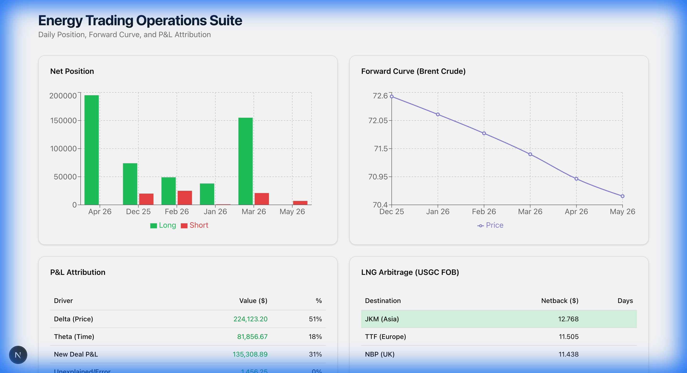

# ⛽ Energy Trading Operations Suite

> **Middle Office Risk & P&L Analytics Platform** — Built for commodity trading desks, this suite provides real-time position monitoring, P&L decomposition, and curve integrity validation.



---

## 🎯 Executive Summary

This project demonstrates **production-grade Middle Office analytics** for energy trading operations, covering the three pillars of commodity risk management:

| Component | Description | Key Metric |
|-----------|-------------|------------|
| **Position & Exposure** | Aggregates physical inventory and paper hedges | Net Flat Price Exposure |
| **P&L Attribution** | Decomposes daily P&L into market drivers | Delta, Theta, FX, New Deals |
| **Curve Integrity** | Validates forward curves for stale marks and anomalies | Fly Checks, Seasonality |

---

## 📊 Core Features

### 1. Daily Position & Exposure Reporting

Aggregates physical inventory (Long) and paper hedges (Short) to generate a **Net Flat Price Exposure** report.

```
Net Exposure = Physical Volume + Paper Volume
             = Long Physical + (−Short Paper)
```

**Key Capabilities:**
- ✅ Netting logic: Physical = Long, Paper = Short
- ✅ Aggregation by Tenor (Month) to identify time spread risk
- ✅ Automatic flagging of positions as `Long`, `Short`, or `Flat`

**Interview Defense Point:**
> *"Even if the total net is zero, I flag 'Time Spread' risk. If we're Long March / Short Feb, that's basis risk my engine captures."*

---

### 2. P&L Attribution Model

Decomposes daily P&L into specific drivers, answering: **"Why did we make (or lose) money today?"**

| Driver | Formula | Description |
|--------|---------|-------------|
| **Delta (Price)** | `(P_t − P_{t-1}) × Position_{t-1}` | P&L from market price movements |
| **Theta (Time)** | `−Position × (P_{M+1} − P_M) / 30` | Cost of carry / roll yield |
| **FX** | `Val(curves_t1, fx_t1) − Val(curves_t1, fx_t0)` | Currency translation impact |
| **New Deals** | `New_Volume × (Curve − Deal_Price)` | Day-1 margin on new trades |
| **Unexplained** | `Official_P&L − Calculated_P&L` | Residual for investigation |

**Theta (Time Decay) Logic:**
```python
# In Contango (upward curve): Longs LOSE value → Negative Theta
# In Backwardation (downward curve): Longs GAIN value → Positive Theta

daily_roll = (next_tenor_price - current_price) / 30  # days
theta_pnl = -signed_volume × daily_roll × days_elapsed
```

**Verified Test Results:**
```
Contango Long (1000 bbl)    → -$66.67/day  ✓ (pay carry)
Backwardation Long (1000 bbl) → +$66.67/day  ✓ (earn carry)
Contango Short (1000 bbl)   → +$66.67/day  ✓ (shorts earn in contango)
```

---

### 3. Curve Integrity Automation

Validates forward curves to catch data quality issues before they impact P&L.

| Check | Logic | Alert Condition |
|-------|-------|-----------------|
| **Stale Marks** | Compare `Price[T]` vs `Price[T-1]` | Price unchanged for >24 hours |
| **Butterfly (Fly)** | `(P_{t-1} − 2P_t + P_{t+1}) / P_t` | Deviation > 5% (2σ) |
| **Seasonality** | Adjusted thresholds for winter months | Dec/Jan/Feb get higher tolerance |

**Interview Defense Point:**
> *"Traders might leave an old, high price on the curve to hide a loss. My script detects stale marks and calendar kinks automatically."*

---

## 🏗️ Architecture

```
┌─────────────────┐     ┌─────────────────┐     ┌─────────────────┐
│   Next.js 16    │────▶│   FastAPI       │────▶│   CSV/Data      │
│   Frontend      │     │   Backend       │     │   Layer         │
│   (Port 3000)   │◀────│   (Port 8000)   │◀────│                 │
└─────────────────┘     └─────────────────┘     └─────────────────┘
     │                        │                       │
     ▼                        ▼                       ▼
  Recharts              Pandas + NumPy           trades.csv
  Components            Processing              forward_curve.csv
  Dashboard             P&L Engine              pnl_attribution.csv
```

**Tech Stack:**
- **Frontend**: Next.js 16, React, Recharts, Tailwind CSS
- **Backend**: FastAPI, Python 3.9+, Pandas, NumPy, SciPy
- **Data**: CSV files (easily extensible to SQL/API)

---

## 🚀 Quick Start

### Prerequisites
- Python 3.9+
- Node.js 18+
- npm or yarn

### 1. Clone & Setup
```bash
git clone https://github.com/yourusername/energy-trading-suite.git
cd energy-trading-suite

# Backend
cd backend
python -m venv .venv
source .venv/bin/activate
pip install -r requirements.txt

# Frontend
cd ../frontend
npm install
```

### 2. Run the Application
```bash
# Terminal 1: Start Backend
cd backend && source .venv/bin/activate
uvicorn main:app --reload

# Terminal 2: Start Frontend
cd frontend
npm run dev
```

### 3. Open Dashboard
Navigate to **http://localhost:3000**

---

## 📁 Project Structure

```
energy_trading_suite/
├── backend/
│   ├── app/
│   │   ├── core/
│   │   │   ├── pnl_engine.py      # P&L decomposition (Delta, Theta, FX)
│   │   │   ├── curve_engine.py    # Curve validation (Stale, Fly, Seasonality)
│   │   │   └── arb_engine.py      # Arbitrage calculations
│   │   ├── services/
│   │   │   ├── data_manager.py    # Position aggregation logic
│   │   │   └── pnl_service.py     # P&L API service
│   │   └── models/                # Pydantic data models
│   └── main.py                    # FastAPI entry point
├── frontend/
│   ├── components/
│   │   └── dashboard/             # React visualization components
│   └── lib/api.ts                 # API client
├── data/
│   ├── trades.csv                 # Sample trade blotter
│   ├── forward_curve.csv          # Market curve data
│   └── pnl_attribution.csv        # P&L breakdown by driver
└── docs/
    └── dashboard.png              # Dashboard screenshot
```

---

## 📈 Sample Data Format

### trades.csv
```csv
trade_id,deal_type,direction,volume,commodity,delivery_month,price
TRD-1000,Physical,Buy,50000,Brent Crude,Apr 26,70.60
TRD-1001,Paper,Sell,10000,Brent Crude,Apr 26,70.51
```

### forward_curve.csv
```csv
curve_date,commodity,tenor,price
2025-12-04,Brent Crude,Dec 25,72.52
2025-12-04,Brent Crude,Jan 26,72.17
```

---

## 🧪 Testing

Run the verification suite to validate all core calculations:

```bash
cd backend
source .venv/bin/activate
python app/verify_features.py
```

**Expected Output:**
```
--- Testing Oil Arb ---
✅ Oil Arb Test Passed

--- Testing FX P&L ---
✅ FX P&L Test Passed

--- Testing Position Aggregation ---
✅ Position Aggregation Test Passed

--- Testing Theta P&L (Time Decay) ---
  Contango Long: -$66.67 ✓
  Backwardation Long: +$66.67 ✓
  Contango Short: +$66.67 ✓
✅ Theta P&L Test Passed
```

---

## 🎓 Key Concepts for Traders/Recruiters

### Why This Matters

| Challenge | Solution in This Suite |
|-----------|----------------------|
| "Where did our P&L come from?" | P&L Attribution breaks down by Delta, Theta, FX, New Deals |
| "Are we hedged?" | Net Exposure shows Long/Short by tenor |
| "Is our curve data clean?" | Stale mark detection + butterfly checks |
| "What's our basis risk?" | Tenor-level aggregation flags time spreads |

### Mathematical Foundations

**Delta P&L (Price Sensitivity):**
$$\Delta P\&L = (P_t - P_{t-1}) \times Position_{t-1}$$

**Theta P&L (Time Decay):**
$$\theta = -\sum_{positions} \left( Volume_i \times \frac{P_{M+1} - P_M}{30} \right)$$

**Butterfly Check (Curve Anomaly):**
$$B_{norm} = \frac{P_{t-1} - 2P_t + P_{t+1}}{P_t}$$

---

## 📜 License

MIT License - feel free to use this for learning or as a portfolio piece.

---

## 👤 Author

Built as a demonstration of Middle Office analytics capabilities for energy trading operations.

**Skills Demonstrated:**
- Commodity trading domain knowledge
- Financial mathematics (P&L attribution, Greeks)
- Full-stack development (React + Python)
- Data engineering (ETL, validation)
